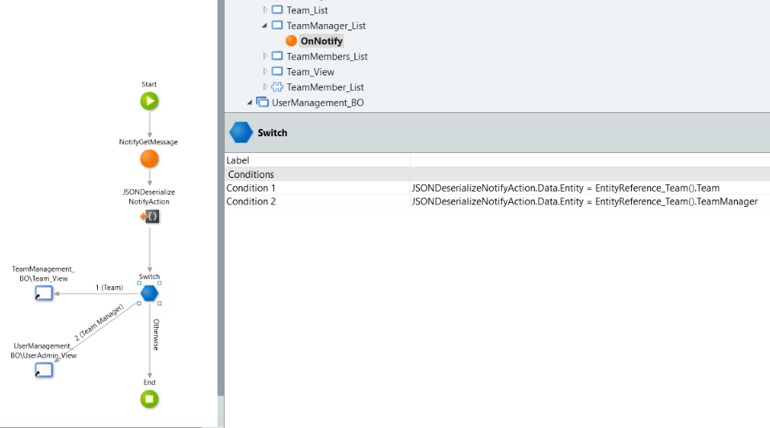

# Outsystems Development standards
So that everyone has a great time developing in Outsystems, we've defined some standards to stick by when building applications.

These standards have come out of learning and working with the platform and Outsystems themselves, they're designed to constrain in the _right_ way so that everyone developing in Outsystems has a better time with minimum amounts of stressing over who did what, why and how.

## Applications
* [ ] _TODO_ - write this section

## Modules
* [ ] _TODO_ - write this section

## Data

### Entities
Entities should be named in singular form.

> Example: `Case` not `Cases`

Entities should have a relevant description.

All entities must have

* A description.
  * _reason_
* `IsActive` _(boolean)_
	* used for 'soft delete' 
* `CreatedDate` _(DateTime)_
	* set on create only
* `ModifiedDate` _(DateTime)_
	* set every time the Entity is modified
* `CreatedBy` _(UserIdentifier)_
	* set on create only
* `ModifiedBy` _(UserIdentifier)_
	* set every time the Entity is modified

#### Default Entity Actions
When you create an Entity, the default actions are automatically generated. These should not be used.

* `Create<Entity>`
* `Get<Entity>`
* `Update<Entity>`
* `Delete<Entity>`

!> These default methods should not be used, instead, create Server Actions to wrap these methods where appropriate.

### Static Entities
As a rule, static entities should be avoided.

## Structures
Structure naming should contain `Str` as a suffix to avoid clashing with an entity's name.

Identifier attributes should be renamed from `Id` to `<Entity>Id`

## Logic

### Server Actions 
Server Actions should be grouped in folders of relevance. For example:
 
* `CREATE`
* `UPDATE`
* `GET`
* `HARDDELETE`
* `SOFTDELETE`

Server Action names should be in PascalCase so that they can be easily identified.

> Example: `GetCustomerById` not `getCustomerById` 

Sometimes the obvious Server Action name will clash with the existing deafult Entity Action

For example, a Customer Entity would have a default action of `CreateCustomer`. 

When creating a Server Action to wrap this Entity Action, you won't be able to use `CreateCustomer` as the name of the Server Action. Instead, we use the convention of `Create_Customer` for the name of the Server Action.

Creation methods should set the `CreatedBy`, `CreatedDate`, `ModifiedBy` and `ModifiedDate` attributes.

Update methods should set `ModifiedBy` and `ModifiedDate` attributes.

!> When setting `DateTime` attributes, system function `CurrDateTime()` should be avoided as this is based on the server time which does not take into account daylight savings. Instead add dependency `LGSSFunctions` and use `CurrLocalDateTime()`.

### Creating your Delete<Entity> Server Action
!> When creating a Server Action that deletes an Entity, **do not** use the default Delete method unless you're absolutely sure what you're doing.

Instead, create your Server Action so that it uses an `Update` method to set the `IsActive` flag to `False`. Naming convention is to call the method `SoftDelete_<Entity>`.

You should also create an `Undelete` Server Action to ensure records can be retrieved easily.

This ensures that records can be deleted in a way that retains the data for Information Management and Retention regulations.

## Interface (UI)

## Processes and Timers

## Variables
Variable names should be in camelCase.

For example:
* `caseId`
* `inputParameter`

## Documentation
Add a description to all public elements and to their parameters (or attributes in the case of Entities or Structures). For example: 

* Entity
* Entity Attribute
* Structure
* Structure Attribute
* Server Action
* Server Action input/output parameters
* Server Action Folders
* Server Action Aggregate

### Making API Calls
Outsystems' default TLS protocol is 1.0. To add TLS 1.2 first create a new `OnBeforeRequest` method.

Then drag the `AddTls12` method from the `ManageSecurityProtocols` extension module. You may have to add this as a dependency if it is not available.

And that's it! Every request made to "ExampleAPI" in this example will now use TLS 1.2. 

### How to use _Notify_ with web blocks
If a web block needs to interact or send data back to the UI layer it can do this with the `Notify` server action, found in the `(System)` dependencies. A common example is viewing a specific record from a list. The list web block notifies the UI of ID of the current record and feeds that to a View screen which renders with information based on that record's ID.

`Notify` has a parameter `Message` which takes the data as a string and sends it up a layer. 

To notify structured data you will first have to JSON serialize it.

Every web block has an `OnNotify` event handler which catches whenever a `Notify` action is triggered.

The `OnNotify` server action in the UI can access the data using the `NotifyGetMessage` server action. Because the UI only has one event handler to handle all notify events, if a web block has more than one `Notify` action it can get messy. To get around this each Core Service module should have a structure called `EntityReference_<ModuleName>`. Each entity in the Core Service should have a corresponding attribute in this structure. Each attribute's data type should be _Text_ and the _Default Value_ should be the name of the entity.

To complement the structure a blank function with an output of the entity reference structure should be set up. This way the name of the entity can be referenced programmatically.

Bearing this in mind all `Notify` actions should look something like this, with the entity reference function determining the type of `Notify`: 

The receiving `OnNotify` UI screen action should look like this:

or

