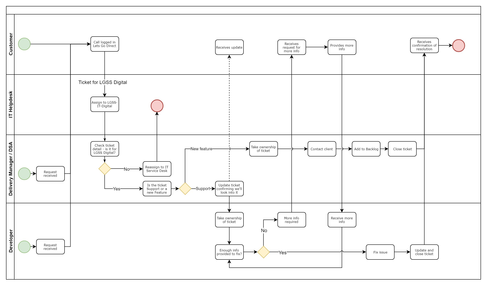

# Support and Operations standards

Support and operations is the most important part of our service.

_It's everyone's job to support the services we build._

To make sure that we develop to the highest standards, everyone works in Ops on a cycle. This means that everyone experiences the bugs, issues, feedback and new feature requests first hand and can take that experience in to project work to ensure that new design and development does not introduce the same kind of problems.

!> If you're not scheduled on a project, you're working with the rest of the team supporting services

## Ops changes

## Support flow

The overall flow for support

